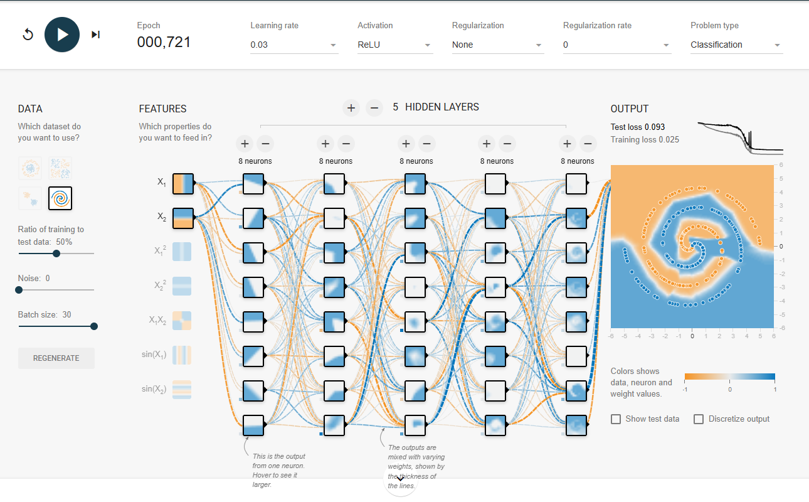
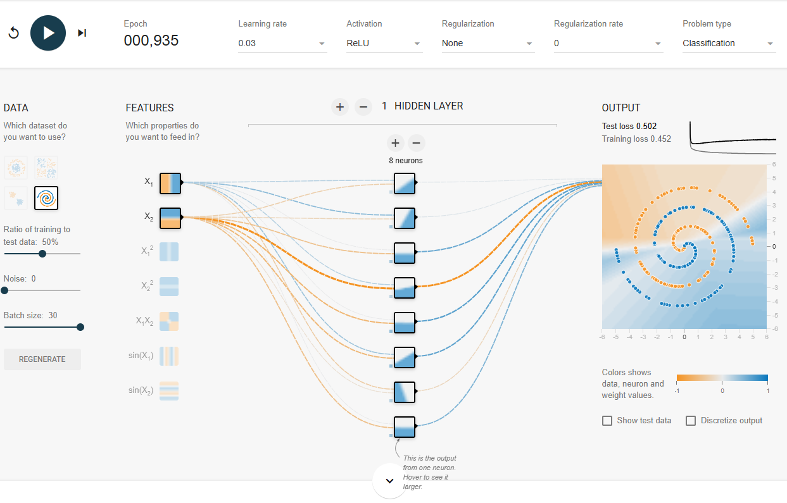
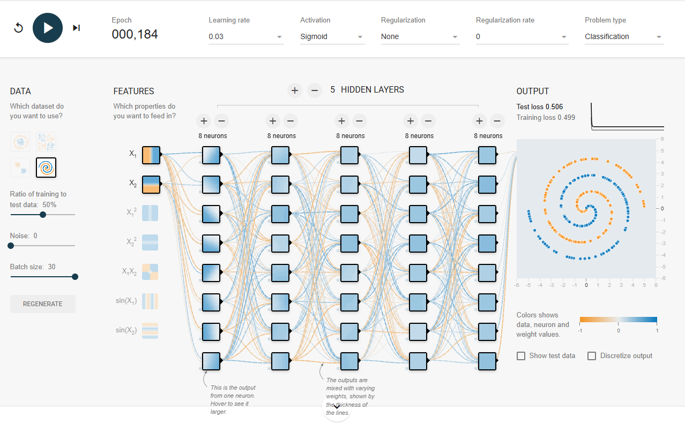
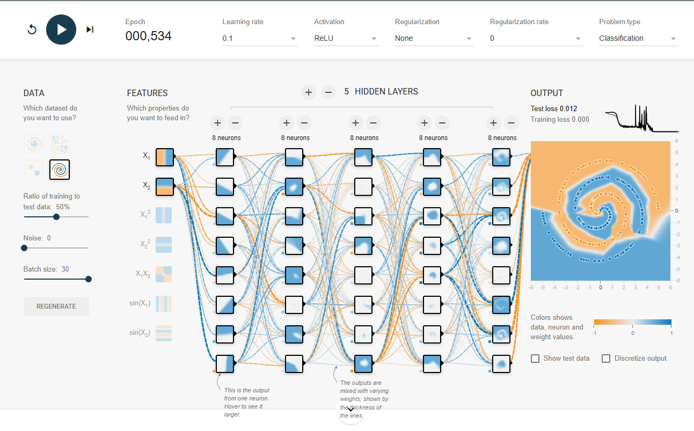
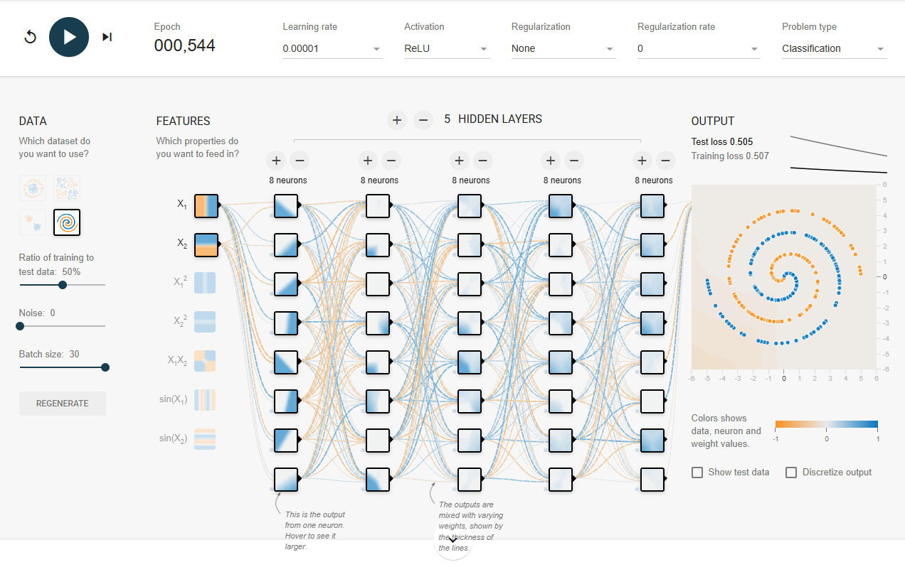
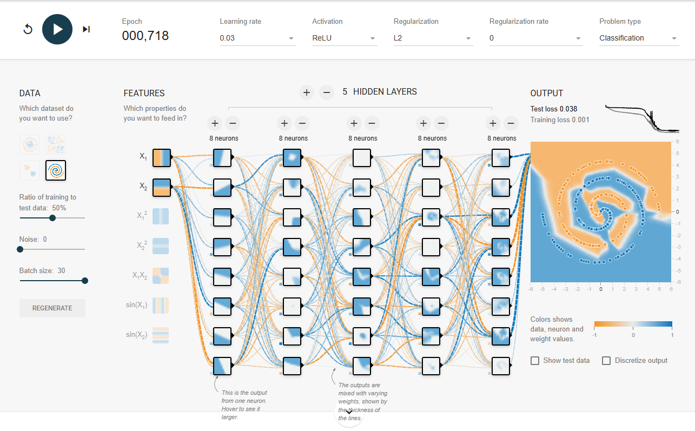

# Relatório de Experimentos - Atividade Aula 4.3

## 1. Configuração do Modelo (Playground TensorFlow)

Para resolver o dataset "Spiral" com um *Test Loss* inferior a 0.1, a seguinte configuração foi utilizada:

* **Dataset:** Spiral
* **Features:** X1, X2
* **Camadas Ocultas:** 5 camadas
* **Neurônios por camada:** 8
* **Ativação:** ReLU
* **Learning Rate:** 0.03
* **Regularização:** None

### Print da Solução

---

## 2. Análise de Parâmetros

Abaixo, os prints comparativos para ilustrar o impacto de cada alteração:

### Comparativo: Número de Camadas
* **Configuração A (1 camada):**
    

### Comparativo: Tipo de Ativação
* **Sigmoid:**
    

### Comparativo: Learning Rate
* **Taxa Alta (0.1):**
    
* **Taxa Baixa (0.00001):**
    

### Comparativo: Fator de Regularização
* **Com Regularização L2:**
    

---

## 3. Conclusões do Exercício

* **Número de camadas:** Aumentar o número de camadas permite que a rede aprenda funções muito mais complexas. Para o dataset Spiral, uma ou duas camadas não conseguem criar as voltas necessárias para separar as classes.
* **Número de neurônios:** Mais neurônios por camada aumentam a "capacidade" da rede de memorizar padrões, mas em excesso podem levar a um modelo muito pesado ou com overfitting.
* **Tipo de ativação:** O uso de ReLU é essencial aqui. A Sigmoid tende a fazer o gradiente desaparecer em redes profundas, tornando o aprendizado extremamente lento ou impossível para o problema da espiral.
* **Learning Rate (Taxa de Aprendizado):**
    * _Muito alta:_ O modelo pode "pular" o mínimo global e a perda (loss) ficará oscilando sem convergir.
    * _Muito baixa:_ O modelo demora muito para aprender, podendo estagnar antes de atingir 0.1 de erro.
* **Regularização:** Ajuda a evitar que o modelo se torne muito complexo "sem necessidade", penalizando pesos muito grandes. É útil se você notar que a fronteira de decisão está muito "irregular" ou se o modelo está com overfitting.